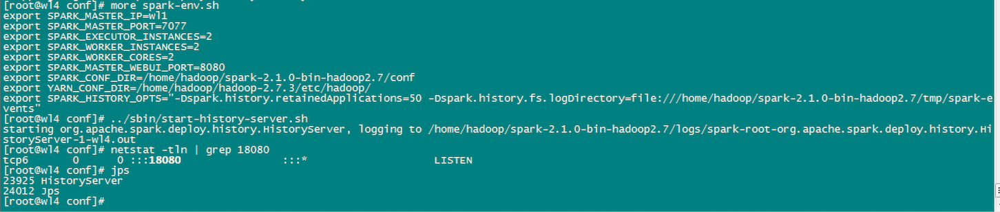
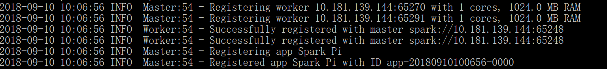
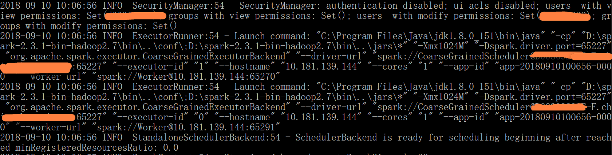

本文介绍Spark 的local，standalone，client和cluster运行模式
<!--more-->

之前搞过一段时间spark，最近一段时间没有搞了，连一些基本概念都忘了，现在补充一下，以防忘记。

当前Spark支持的运行模式有

- local 本地运行模式，是用单机的多个线程来模拟Spark分布式计算，通常用来验证开发出来的应用程序逻辑上有没有问题。
- standalone 该方式适用master和worker进程来模拟集群形式，不需要启动hadoop
- YARN-cluster 该方式是使用YARN来做集群管理，为Spark应用分配资源。


# Local[N]模式

该方式下，在程序执行过程中，只会生成一个SparkSubmit进程。这个SparkSubmit进程又当爹、又当妈，既是客户提交任务的Client进程、又是Spark的driver程序、还充当着Spark执行Task的Executor角色。

其中N代表可以使用N个线程，每个线程拥有一个core。如果不指定N，则默认是1个线程（该线程有1个core）。

如果是local[*]，则代表 Run Spark locally with as many worker threads as logical cores on your machine.


## local方式下如何在web界面看应用程序的执行情况？

因为driver程序在应用程序结束后就会终止，那么如何在web界面看到该应用程序的执行情况呢，需要如此这般
```
先在spark-env.sh 增加SPARK_HISTORY_OPTS；

然后启动start-history-server.sh服务；

就可以看到启动了HistoryServer进程，且监听端口是18080。

之后就可以在web上使用http://hostname:18080愉快的玩耍了。

```


# Local伪集群模式

这种运行模式，和Local[N]很像，不同的是，它会在单机启动多个进程来模拟集群下的分布式场景，而不像Local[N]这种多个线程只能在一个进程下委屈求全的共享资源。通常也是用来验证开发出来的应用程序逻辑上有没有问题，或者想使用Spark的计算框架而没有太多资源。

用法是：提交应用程序时使用local-cluster[x,y,z]参数：x代表要生成的executor数，y和z分别代表每个executor所拥有的core和memory数。

```
spark-submit --class org.apache.spark.examples.SparkPi --master local-cluster[2,1,1024] ../examples/jars/spark-examples_2.11-2.3.1.jar
```

上面这条命令代表会使用2个executor进程，每个进程分配1个core和1G的内存，来运行应用程序。






# standalone client模式

和单机运行的模式不同，这里必须在执行应用程序前，先启动Spark的Master和Worker守护进程。不用启动Hadoop服务，除非你用到了HDFS的内容。

```
start-master.sh
start-slave.sh -h hostname url:master
```

启动的进程会有Master和Worker进程，非master进程只会有Worker进程。
这种运行模式，可以使用Spark的8080 web ui来观察资源和应用程序的执行情况了。

用如下命令提交应用程序
```
spark-submit --master spark://wl1:7077

或者 spark-submit --master spark://wl1:7077 --deploy-mode client
```

Master进程做为cluster manager，用来对应用程序申请的资源进行管理；

SparkSubmit 做为Client端和运行driver程序；

CoarseGrainedExecutorBackend 用来并发执行应用程序；


# standalone cluster模式

这种运行模式和上面第3个还是有很大的区别的。使用如下命令执行应用程序（前提是已经启动了spark的Master、Worker守护进程）不用启动Hadoop服务，除非你用到了HDFS的内容。

```
spark-submit --master spark://wl1:6066 --deploy-mode cluster
```

与client的区别
1. 客户端的SparkSubmit进程会在应用程序提交给集群之后就退出

2. Master会在集群中选择一个Worker进程生成一个子进程DriverWrapper来启动driver

3. 而该DriverWrapper 进程会占用Worker进程的一个core，所以同样的资源下配置下，会比第3种运行模式，少用1个core来参与计算(观察下图executor id 7的core数)（区别3）

4. 应用程序的结果，会在执行driver程序的节点的stdout中输出，而不是打印在屏幕上

# YARN client模式
在Resource Manager节点上提交应用程序，会生成SparkSubmit进程，该进程会执行driver程序。
M会在集群中的某个NodeManager上，启动一个ExecutorLauncher进程，来做为

ApplicationMaster。另外，也会在多个NodeManager上生成CoarseGrainedExecutorBackend进程来并发的执行应用程序。
```
spark-submit --master yarn 

或者 spark-submit --master yarn --deploy-mode client
```


# YARN cluster模式

```
spark-submit --master yarn --deploy-mode cluster
```
和YARN client模式区别

在Resource Manager端提交应用程序，会生成SparkSubmit进程，该进程只用来做Client端，应用程序提交给集群后，就会删除该进程。

Resource Manager在集群中的某个NodeManager上运行ApplicationMaster，该AM同时会执行driver程序。紧接着，会在各NodeManager上运行CoarseGrainedExecutorBackend来并发执行应用程序。

应用程序的结果，会在执行driver程序的节点的stdout中输出，而不是打印在屏幕上。

> https://www.jianshu.com/p/65a3476757a5